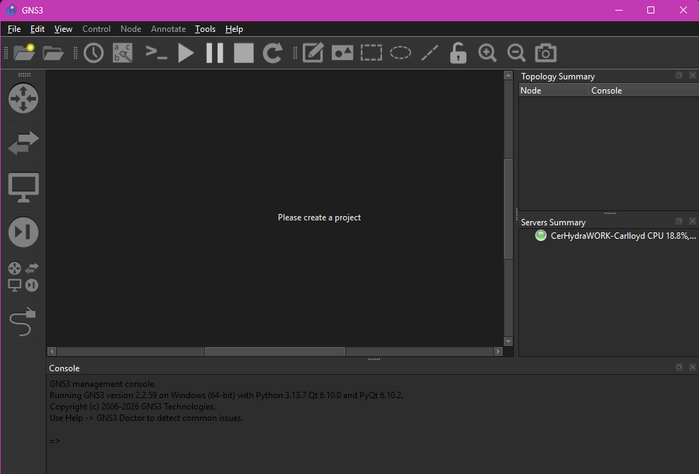

# Week 01 – Introduction to Internetworking

## Creating a GitHub Repository

A GitHub repository was created to document weekly learning activities and laboratory exercises completed throughout the course. Maintaining a weekly journal provides a record of progress and serves as a reference for future topics.


The repository was then cloned to the local machine using Visual Studio Code, making it easier to manage files, track changes, and publish updates to GitHub.


---

## Installing GNS3

As part of the tutorial, **GNS3 (Graphical Network Simulator 3)** was installed to emulate, configure, test, and troubleshoot virtual network environments. GNS3 enables realistic network simulations without requiring physical networking hardware.



---

## Launching GNS3 with Oracle VirtualBox

Using the OVA appliance provided during the tutorial, the GNS3 virtual machine was imported and launched using **Oracle VirtualBox**.


After the virtual machine started successfully, the GNS3 Web UI was accessed through the following address:

```
http://192.168.56.101
```

The web interface allows users to configure and manage network devices and virtual hosts.


---

## Configuring a Linux Host

A Linux host was added to the GNS3 workspace and its network configuration was edited.


Within the configuration file, the required network settings were enabled by removing the comment (`#`) characters. This allows the configuration to be applied when the host starts.

In this exercise, the Linux host was assigned its own IP address.


After applying the configuration and starting the node, the Linux console was opened to verify that the IP address had been assigned correctly using the following command:

```bash
ip a
```


---

# Reflection

This introductory exercise provided hands-on experience with setting up a virtual networking environment using GNS3 and Oracle VirtualBox. Learning how to configure virtual hosts and verify network settings establishes a strong foundation for future laboratory activities. Throughout the course, GNS3 will be used to design, configure, test, and troubleshoot increasingly complex network topologies before implementing similar configurations on physical networking equipment.
