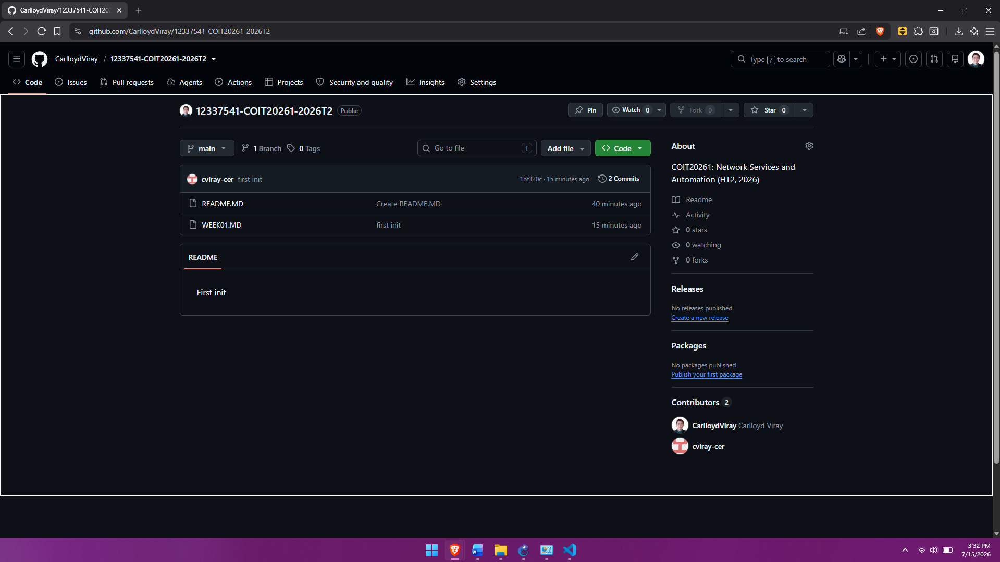
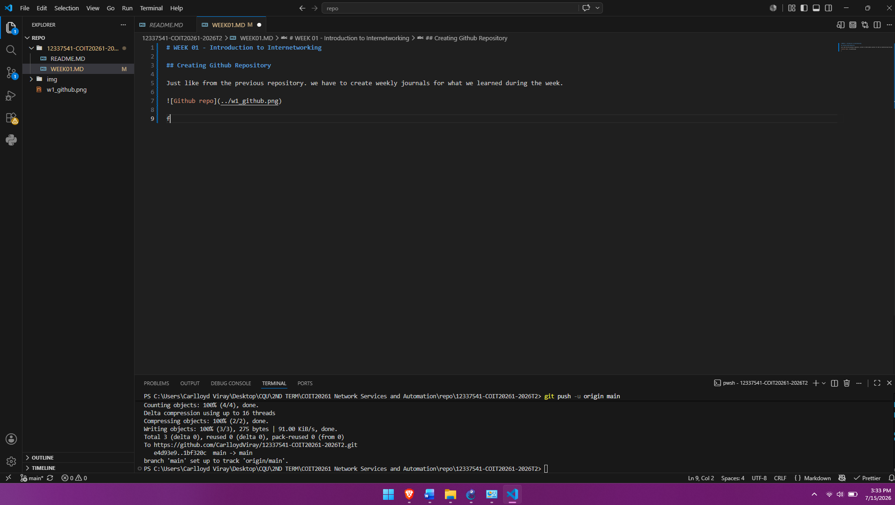

# WEEK 01 - Introduction to Internetworking

## Creating Github Repository

Just like from the previous repository. we have to create weekly journals for what we learned during the week.

I also cloned it to my local machine for ease of publication of weekly journals

## Installing GNS3

From the turorial classes, we were instructed to install GNS3 to emulate, configure, test, and troubleshoot virtual networks.

## Opening GNS3 with Oracle Virtual Box
