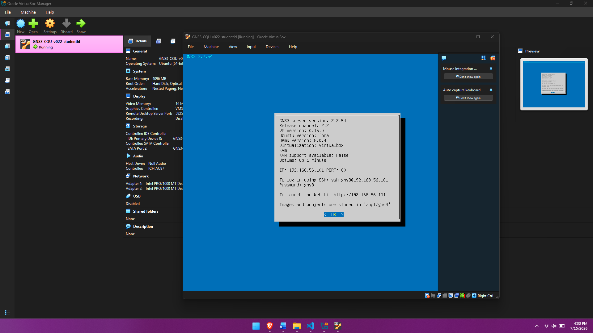
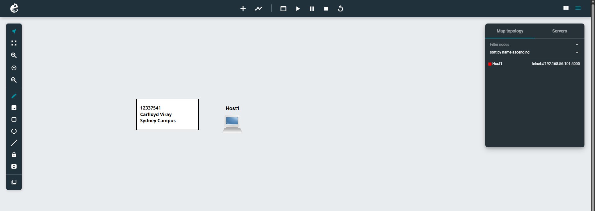
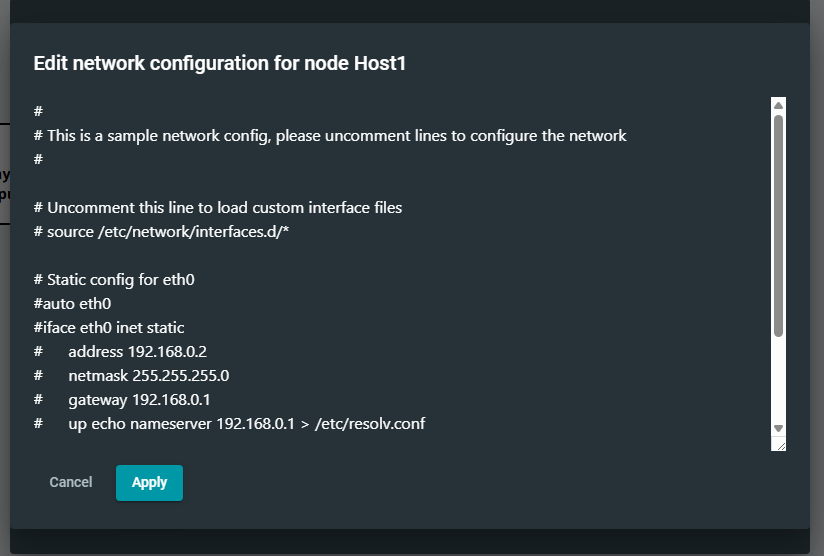
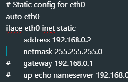
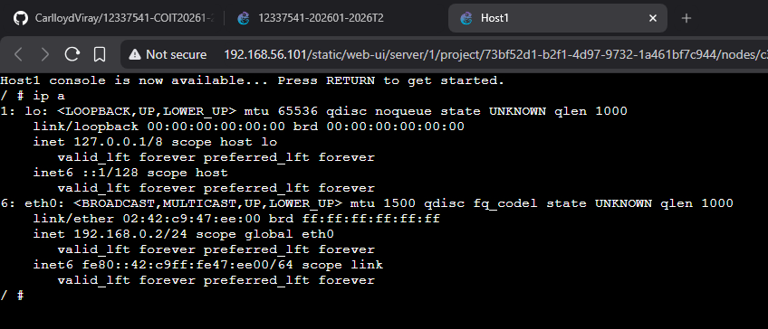

# WEEK 01 - Introduction to Internetworking

## Creating Github Repository

Just like from the previous repository. we have to create weekly journals for what we learned during the week.

I also cloned it to my local machine for ease of publication of weekly journals

## Installing GNS3

From the turorial classes, we were instructed to install GNS3 to emulate, configure, test, and troubleshoot virtual networks.

## Opening GNS3 with Oracle Virtual Box

Using the OVA file provided. I opened it via oracle virtual box to continue with the tutorial

Visiting the Web UI: 192.168.56.101 will show the virtual box user interface where we can configure different nodes and netwroking.

We put a linux server in the canvas and proceed to edit its configuration

Here we can manually edit or add cofnigurations. Making sure that the has comment is deleted in order to apply the config.
In this case, we removed the comments in order for the host pc to have its own ip address.

Applying all configurations and starting the node will run the network. To verify, we will be using the console web and run a linux command to check the ip address using the command ip a

## Reflection

The GNS3 will help us in later tutorial classes on how we can optimize, configure, make connections between hosts via virtual machines. This will help us visualize the network first before applying it in hardware.
