# WEEK 01 - Trasport Layer Protocol

## Creating new project in GNS3

"GNS3 (Graphical Network Simulator-3) is a free, open-source network emulator used by network professionals and students to build, design, and test complex topologies without physical hardware. It combines virtual machines, container environments, and emulated network hardware into a single sandbox"

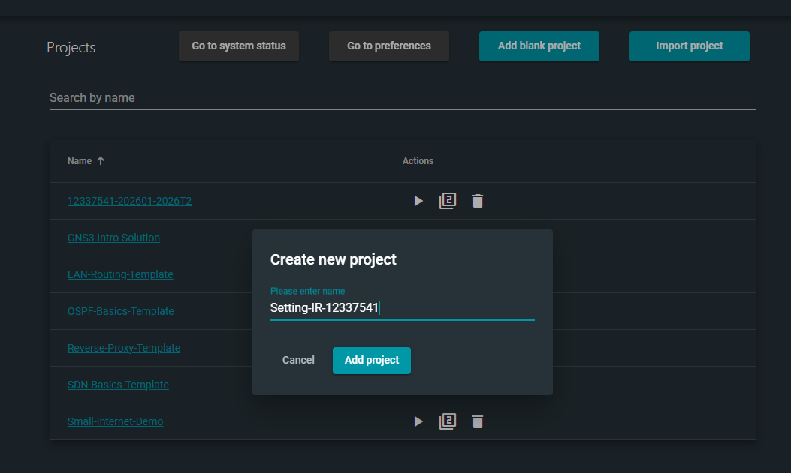

## Making the diagram

Adding four Linux hosts and on ethernet switch connected by LAN. Two hosts' IP address will be changed in 10.1.1.0/24 while the other to is as is (Default)

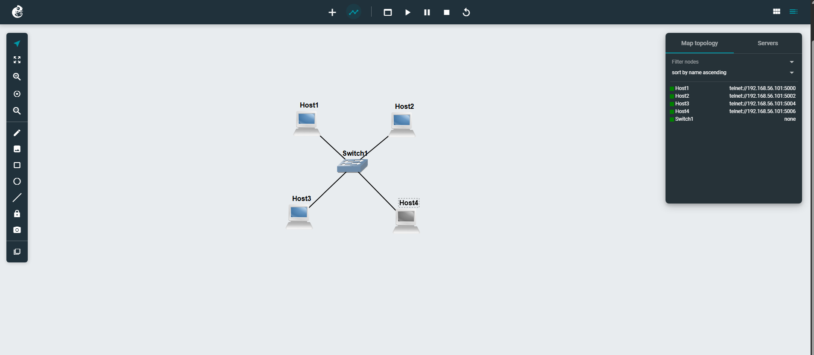

IP Address of Host 1:

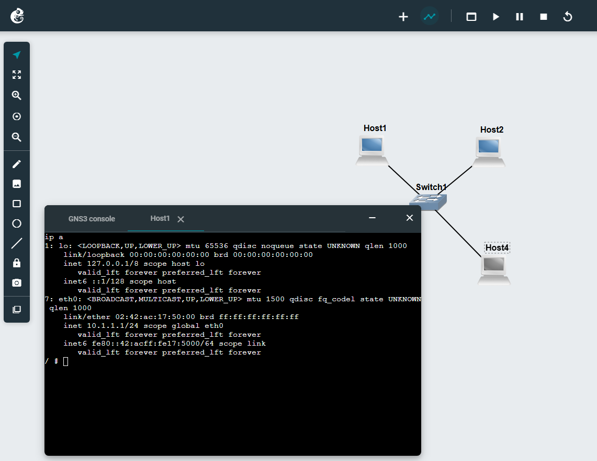

IP Address of Host 2:

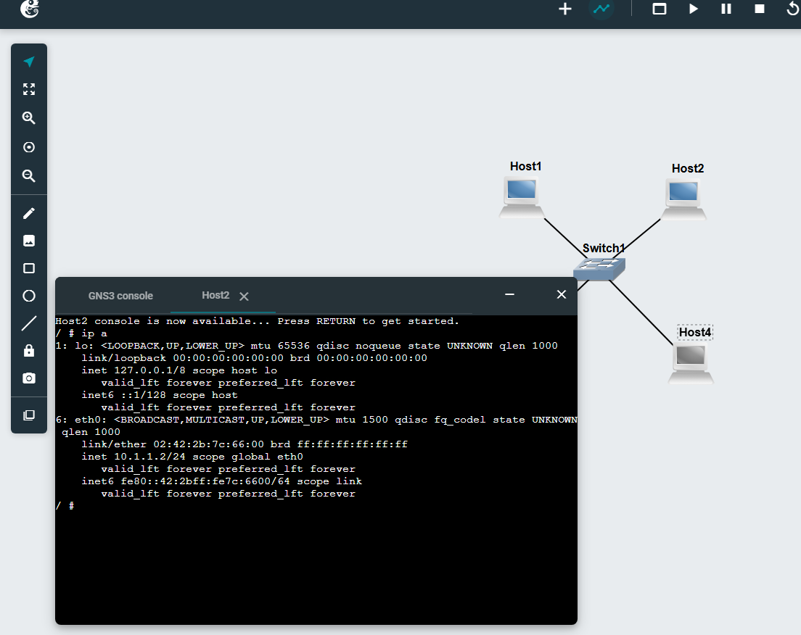

## Changint static ip addreess via console

Using Linux command `nano /etc/network/interface`

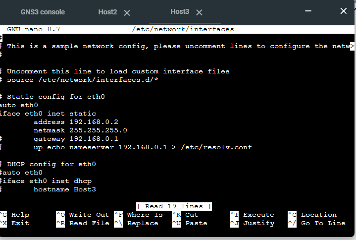
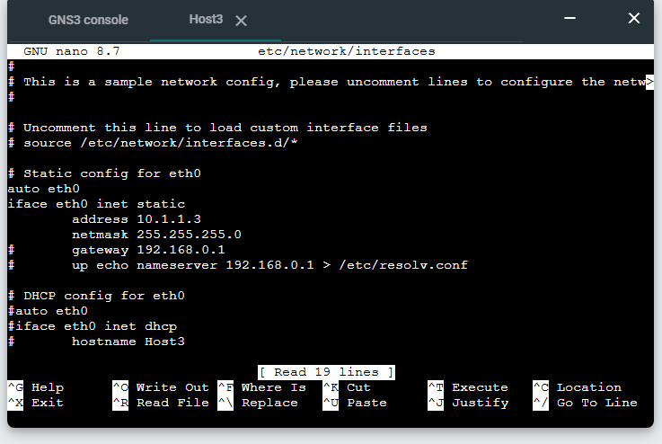

Rather than changing it via web UI, we use linux command to change it explicitly

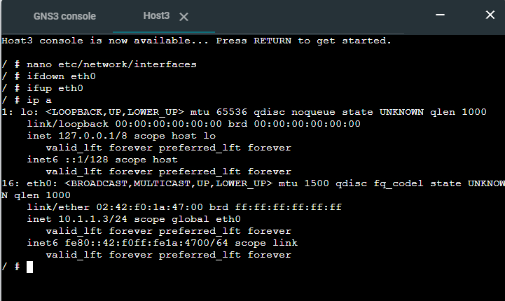

change IP Address for the 4th host using explicit command

`ip addr add 10.1.1.4/24 dev eth0`

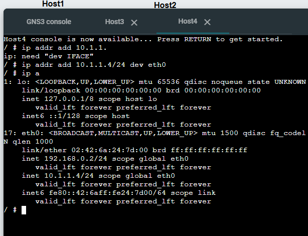

## Ping to hosts in the network

Pinging other hosts via host1 using command `ping 10.1.1.2`

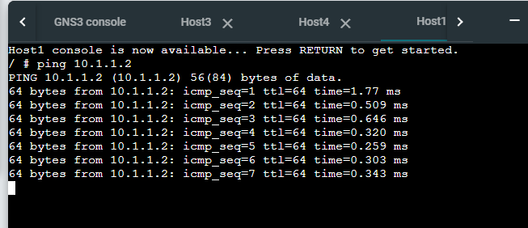
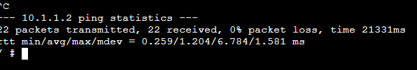

Pinging non-existent host ip
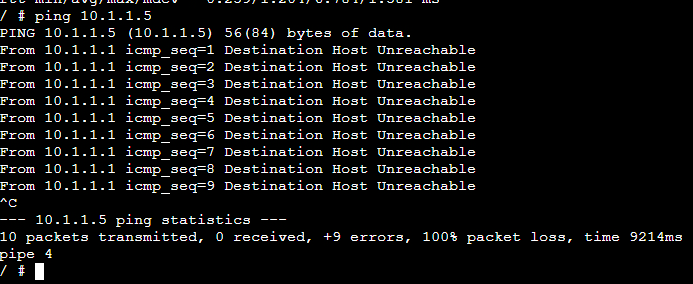

Trying different command lines by changing count of ping, interval, and size

-c is count of ping
`ping -c 3 10.1.1.2`
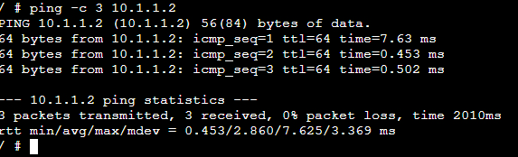

-i is interval, meaning time before next ping
`ping -i 10 10.1.1.2`
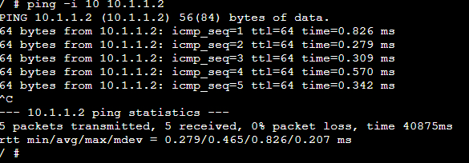

-s is packet size (Default is bytes)
`ping -s 100 10.1.1.2`
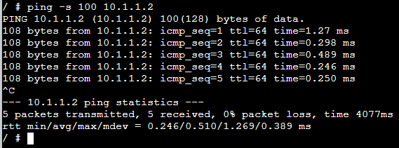

combining all commands
`ping -c 2 -i 7 -s 100 10.1.1.2`
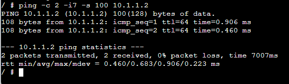
