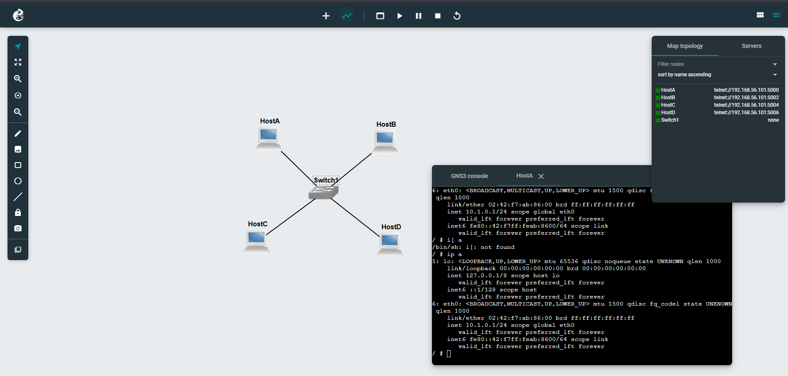
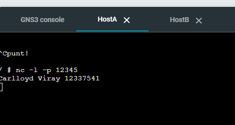
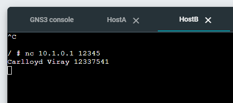
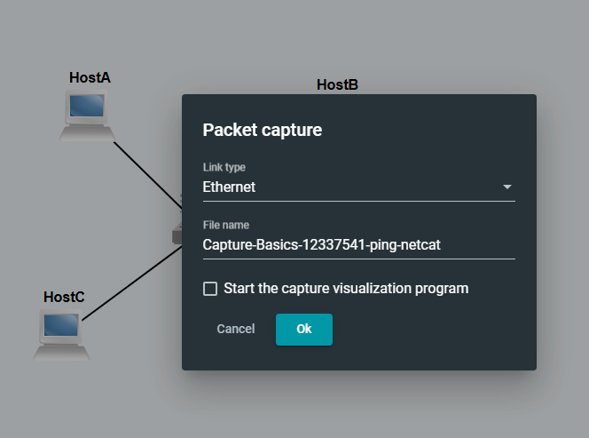
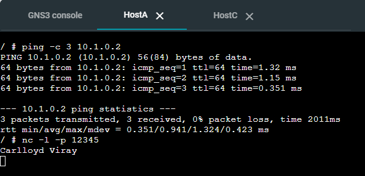
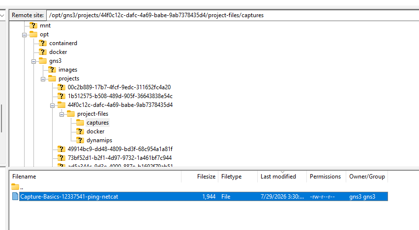
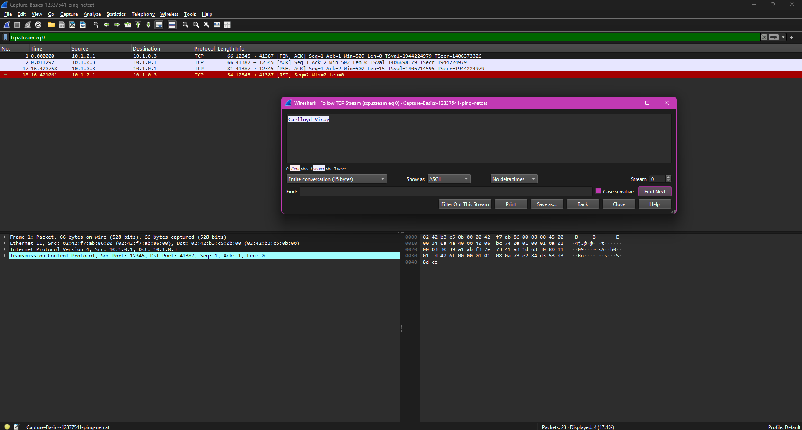

# Week 03 – Transmission Control Protocol

Netcat vs Ping

Netcat is a simple client/server application that allows you to send messages between two devices. It is commonly used for testing whether two devices can communicate successfull across the Internet. It is different from ping in that netcat uses application level messaging (via TCP or UDP), while ping uses network level messaging (via ICMP). It is good practice to test communications between devices using both Ping and Netcat, as occasionally one will be successful but the other may not.

## Creating a New Project for NetCat

Add 4 linux servers connected by one thernet with netwrok address 10.1.0.0/24



## Start NetCat

Using the linux command to start netcat server in HostA

```bash
nc -l -p 12345
```

-l is listening and -p is port number

Start NetCat on HostB to start sending packets to primary netcat server

```bash
nc 10.1.0.1 12345
```

With this, 2 hosts can now communicate with each other albeit one way from sender to receiver




## Capturing Packets

Click link of HostA to ethernet



Start sending ping from HostA to HostB with three packets and also start NetCat and send name from HostC to Host A



Stop ping capture and locate pcap file in directory: /opt/gns3/projects/ directory



## Opening capture packets

Using the analyze->follow->TCP stream, it shows the sent message from the host to the server via NetCat

