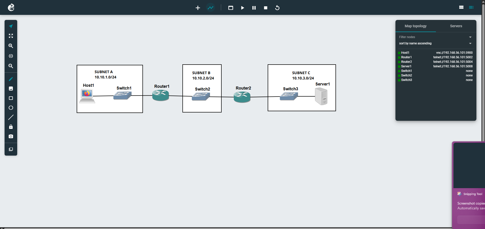
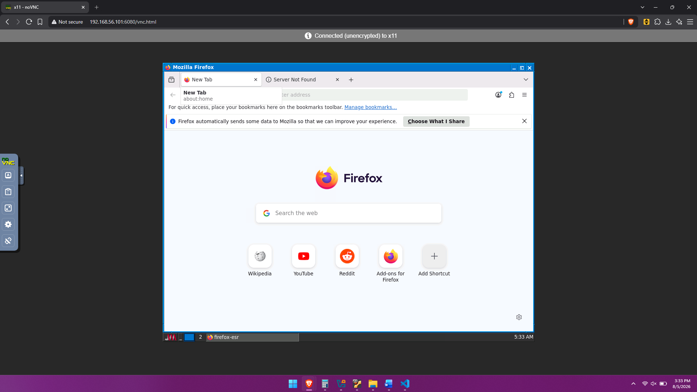
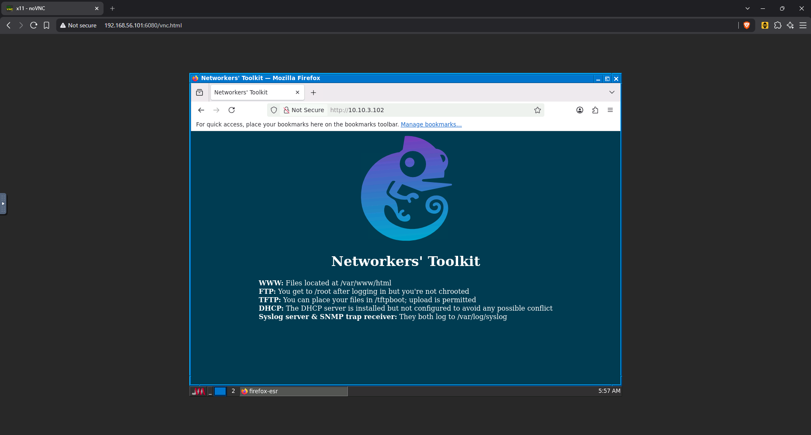
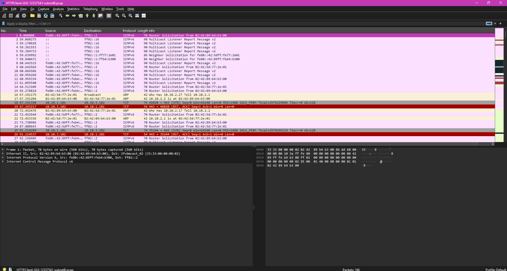
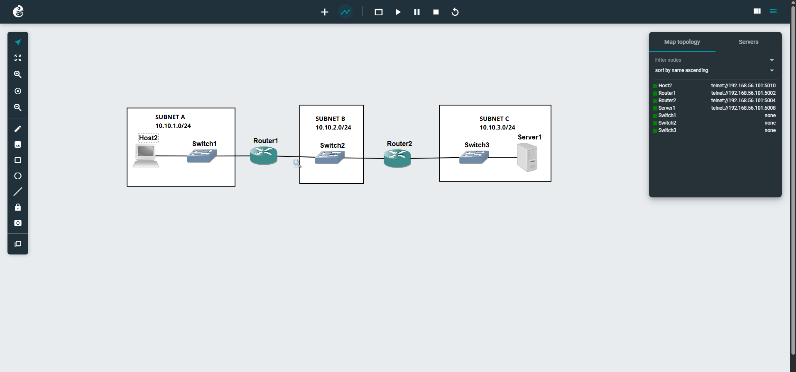
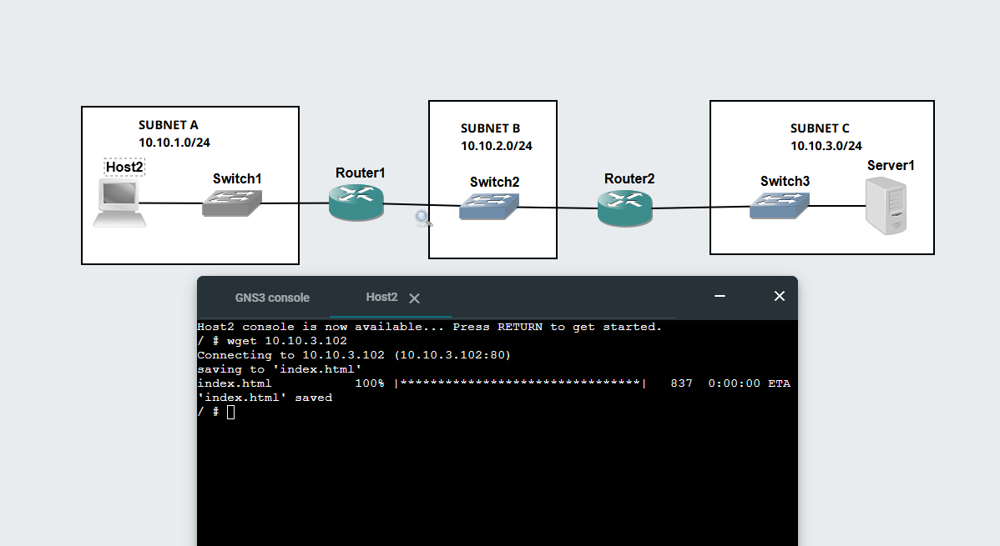
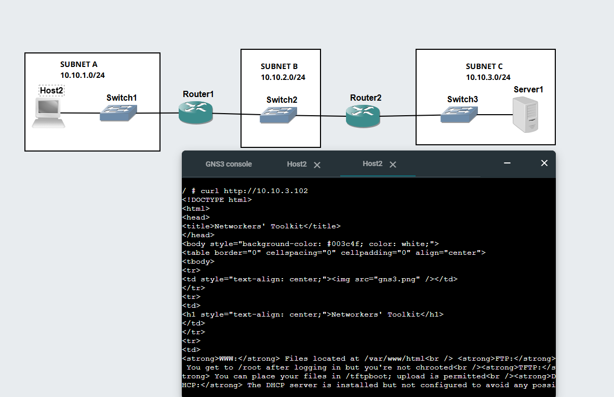

# Week 03 – Classful & Classless Addressing

## Task 1

Create a network consisting of three subnets: **Subnet A**, **Subnet B**, and **Subnet C**.

- **Subnet A** contains:
  - A switch
  - A Firefox Host (HTTP client)
- **Subnet B** contains:
  - A switch connecting **Router 1** and **Router 2**
- **Subnet C** contains:
  - A switch
  - A Linux Server (HTTP server)

**Network topology:**



### Using the VNC Client on Host1

From the VM shell, edit the VNC startup script:

```bash
nano ./start-vnc.sh
```

Configure it to use ports **5900** and **6080**, then save the file and start the VNC service.

Open the following URL in your browser:

```text
http://192.168.56.101:6080/vnc.html
```



Once the VNC session opens, launch the Mozilla Firefox host and enter the IP address of the Linux server.

While accessing the web server, capture the packets on **Subnet B** using Wireshark.



### Ping Packet Capture

Perform a ping test from the client to the server and capture the packets traversing **Subnet B**.



---

## Task 2

Repeat **Task 1**, but replace the **Firefox Host** with a **Linux Host**.

**Network topology:**



### Accessing the Web Server with `wget`

From the Linux Host terminal, use:

```bash
wget http://10.10.3.102
```

This downloads the default web page from the Linux server.



### Accessing the Web Server with `curl`

To display the web page directly in the terminal, run:

```bash
curl http://10.10.3.102
```


