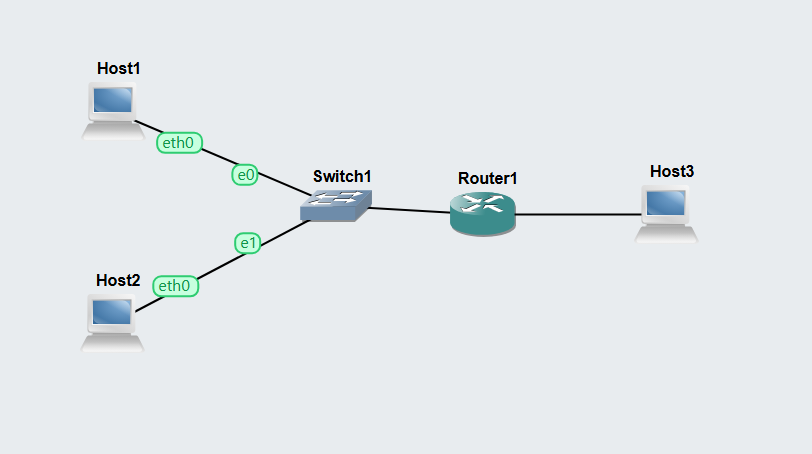
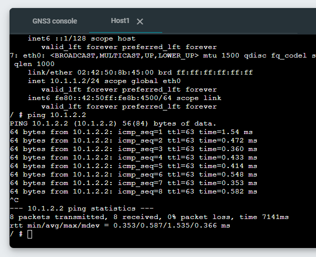
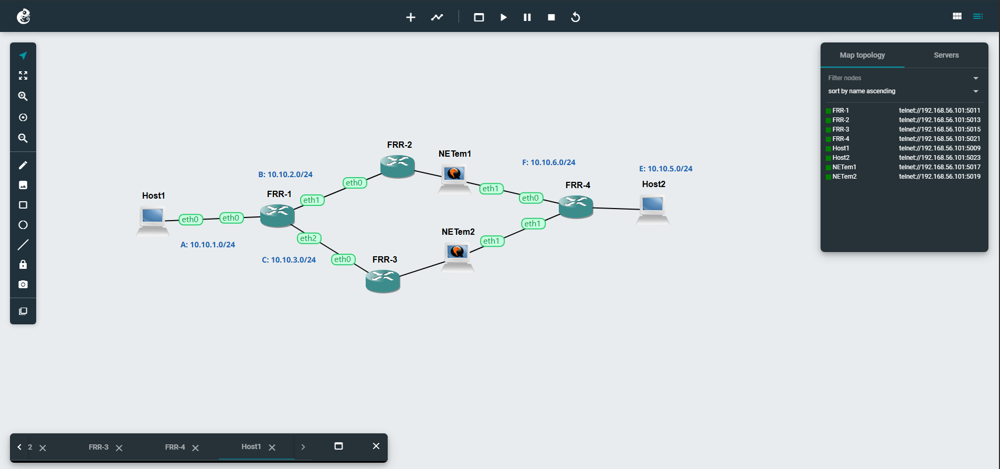
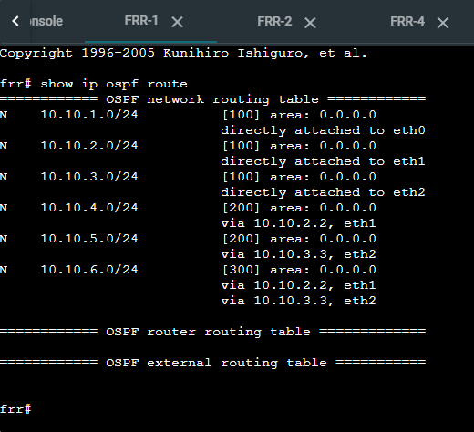
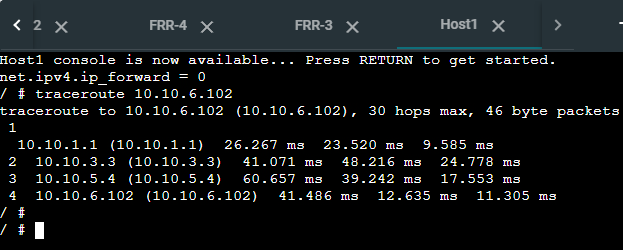

# Week 05 – Routing

## View Routing Tables

Add two (2) nodes of type Linux Host and one node of type Linux Router, with all three nodes connected to one Ethernet switch. Then add a third Linux Host connected directly to the Linux Router. In total there are three hosts, one router and one switch, creating two subnets.

The general format of the file for interface eth0 is:

auto eth0
iface eth0 inet static
address <ipaddress>
netmask <networkmask>
gateway <routerip>
up sysctl net.ipv4.ip_forward=<0or1>

Pinging host 3 from host 1

## Dynamic Routing with OSPF

Import the OSPF-Basics-Template.gns3project project, and duplicate as `OSPF-Basics-.gns3project``.

frr#
If you see instead frr:~# then run vtysh.
You can now run special commands for the router. Note that is a different syntax than normal Linux commands.
Viewing Routing Information with FRR
Once in the frr# prompt, you can use the following commands to show:
• Neighbour routers, i.e., routers that this FRR is connected to
• Routes maintained by OSPF, i.e., the next node to reach a destination. These are dynamic routes, created automatically by OSPF.
• Routes used by Linux for forwarding packets. This includes the routes maintained by OSPF, plus other routes (e.g., static routes added by the user or dynamic routes added by other routing protocols).

run this command for frr1
show ip ospf neighbor

show ip ospf route
show ip route

traceroute from h1 to h2

