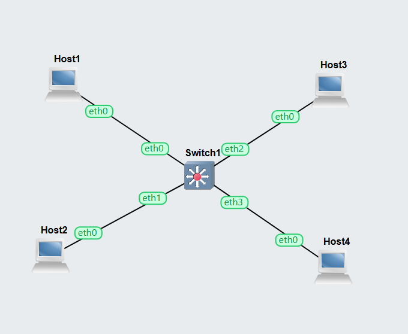
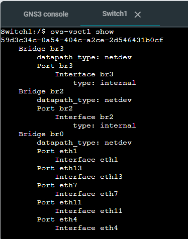
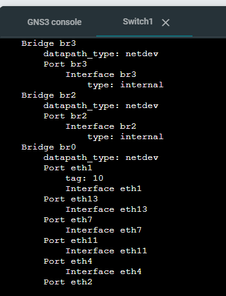

# Week 06

## Create openvswitch

hosts are 192.168.5.0/24 subnet



Run command:

```bash
nano sh /etc/openvswitch/init.sh
nano ovs-vsctl show
```



Assign each port to an id or tag

```bash
nano ovs-vsctl set port eth0 tag=10
```

Do this for all hosts depending on what port number are the using.
This will assign tags to ethernet ports


