# Week 07

## task 1. Resolving IP Addresses to Hardware Addresses

Use the Setting-IP-<studentid> project which contains four Linux hosts and one Ethernet switch

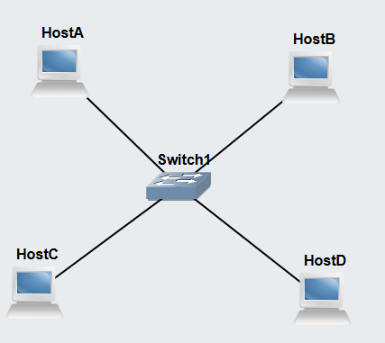

Ping from host A to host B

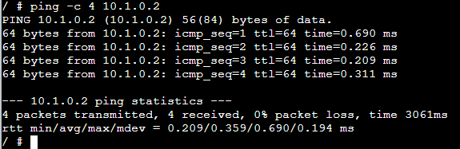

Show ARP table for Host A

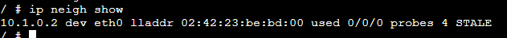

```bash
nano ip neigh show
```

Pinging from Host C to Host A


Final ARP table for HOST A

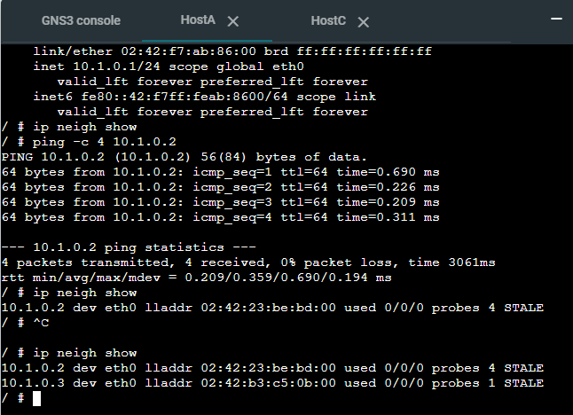

## Task 2: Default Gateways

Create a network with two Linux Hosts connected to a Linux Router 1 via one Ethernet switch in one subnet, another two Linux Hosts connected to a second Linux Router 2 via another Ethernet switch in a second subnet, and the two routers connected directly together to form a third subnet. In total, there are 4 hosts, 2 switches and 2 routers, creating 3 subnets.

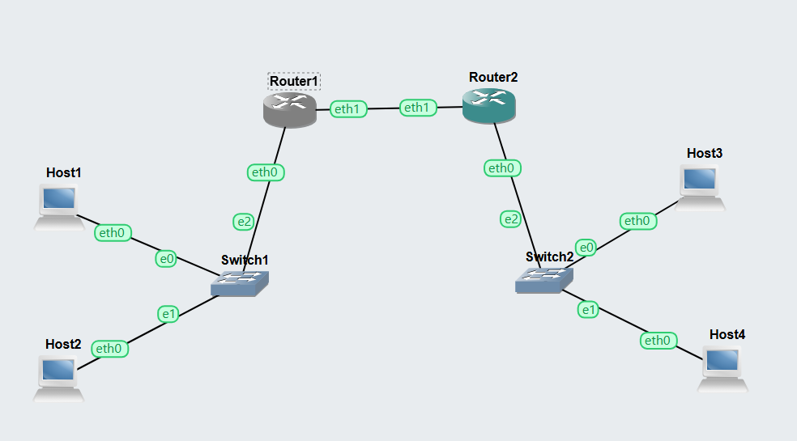

Router 1 and 2 link to each other's subnet

```bash
nano echo 1 > /proc/sys/net/ipv4/ip_forward
nano ip addr add 10.1.1.1/24 dev eth0
nano ip addr add 10.0.0.1/30 dev eth1
nano ip link set eth0 up
nano ip link set eth1 up
nano ip route add 10.1.2.0/24 via 10.0.0.2 dev eth1
```

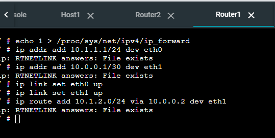
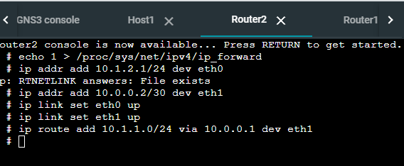

Pinging from host A subnet 1 to host D subnet 3

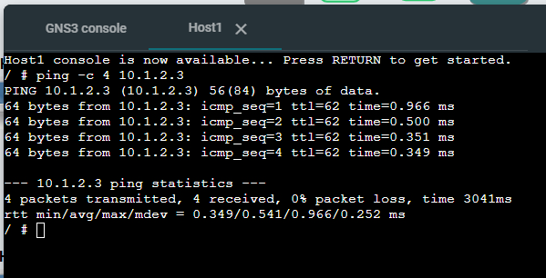

routing tables for each routers and hosts

Host A
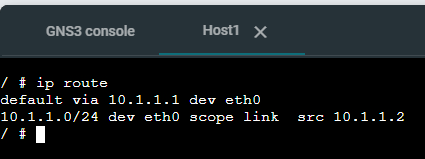

Host B
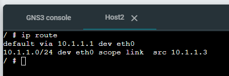

Host C
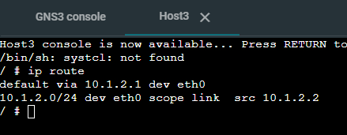

Host D
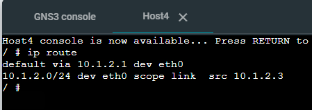

Router 1
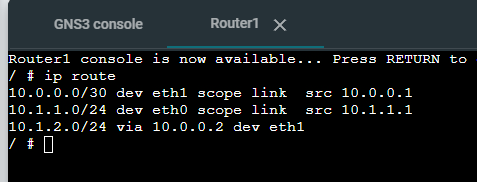

Router 2
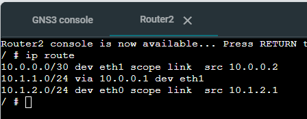
