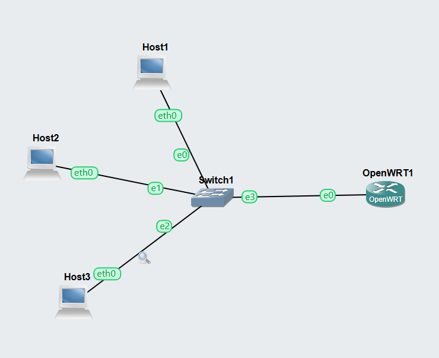
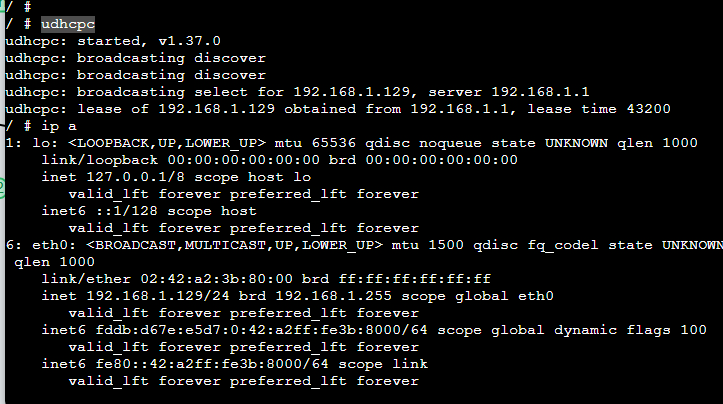
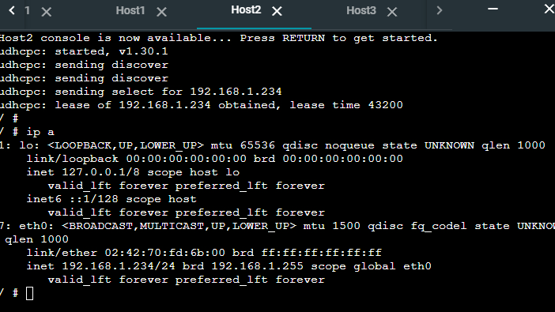
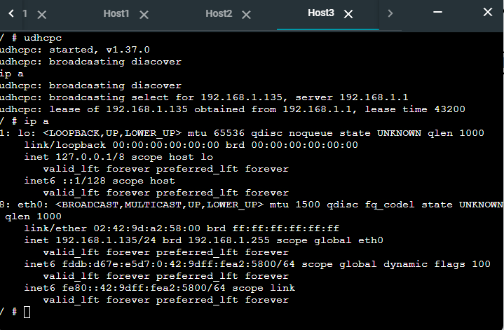

# Week 08

## task 1. DHCP Client

Add three (3) Linux Host nodes and one OpenWRT Router node and connect the four via an Ethernet switch. Connect to eth0 of the OpenWRT router.


start openwrt and open console

Using udhcpc

```bash
nano udhcpc
```



Using udhcpc gets the IP Address from OPENWRT server and changes hosts' ip address respectively.

Host 1 address


Host 2 address


Host 3 address

