# Week 09 Web Services

## task 1.

include linux host, firefox host and a linuxserver connected by a switch
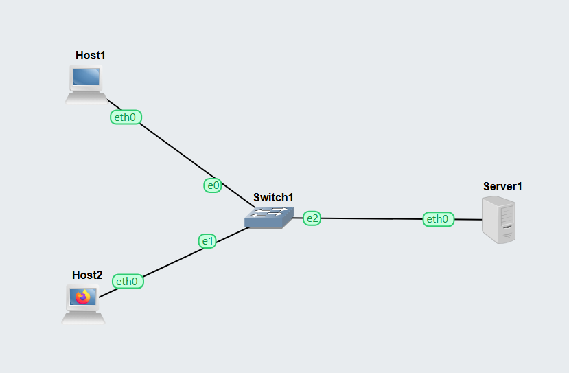

pinging from host 1 to host 2 for checking
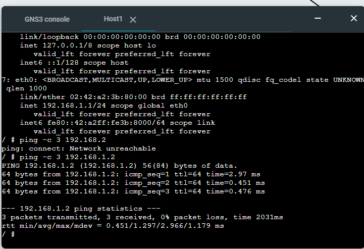

show information of file patch using cat command
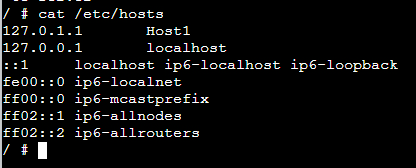

edit file directory using nano and add server ip with custom domain name
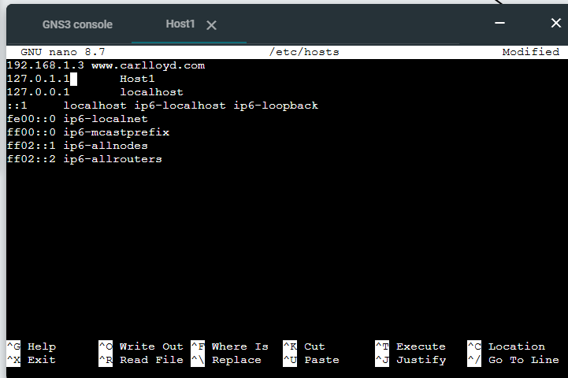

Use command curl to view the html
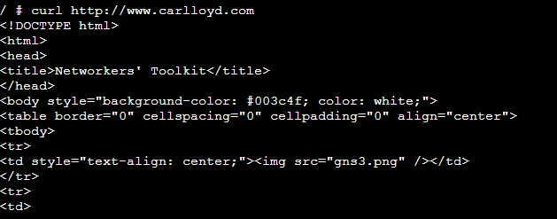

Go to terminal shell of gns3 and type ./start-vnc.sh 5900 6080
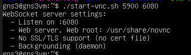

go to new tab and type http://192.168.56.101:6080/vnc.html
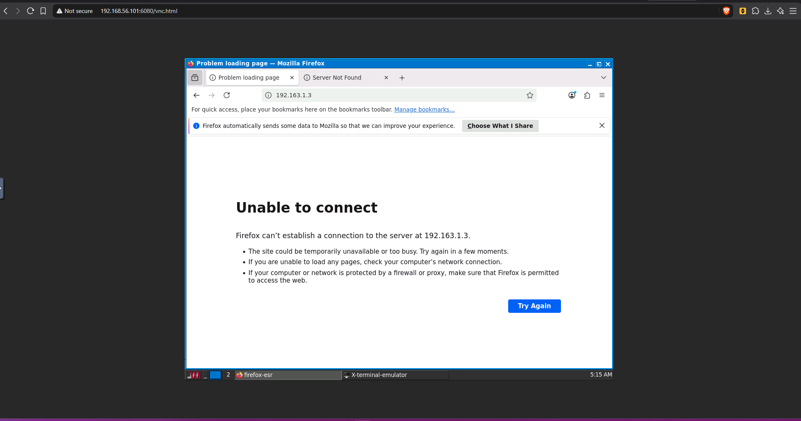

go to server 1 and create self-signed certificate

openssl req -x509 -nodes -days 365 -newkey rsa:2048 -keyout nginx-selfsigned.key -out nginx-selfsigned.crt
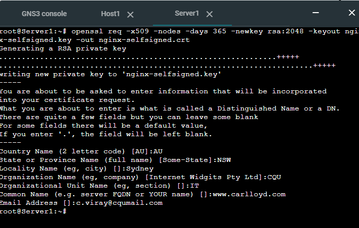

Make directories and copy the certificate/key in:
mkdir -p /etc/ssl/certs
mkdir -p /etc/ssl/private
cp nginx-selfsigned.crt /etc/ssl/certs
cp nginx-selfsigned.key /etc/ssl/private
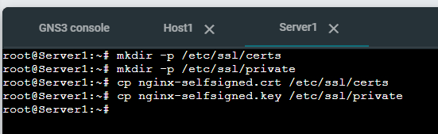

Configure Nginx for HTTPS
nano /etc/nginx/snippets/self-signed.conf

ssl_certificate /etc/ssl/certs/nginx-selfsigned.crt;
ssl_certificate_key /etc/ssl/private/nginx-selfsigned.key;
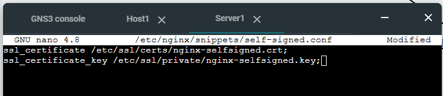

make backup
cp /etc/nginx/sites-available/default /etc/nginx/sites-available/default.bak

edit config file
nano /etc/nginx/sites-available/default

server {
listen 80 default_server;
listen [::]:80 default_server;
listen 443 ssl http2 default_server;
listen [::]:443 ssl http2 default_server;

    include snippets/self-signed.conf;

    server_name www.example.com;

...
}

Check there are no errors in the configuration:
nginx -t
You should see syntax ok and test is successful.
Finally, restart nginx:
/etc/init.d/nginx restart
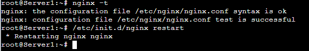

Using curl for Testing HTTPS
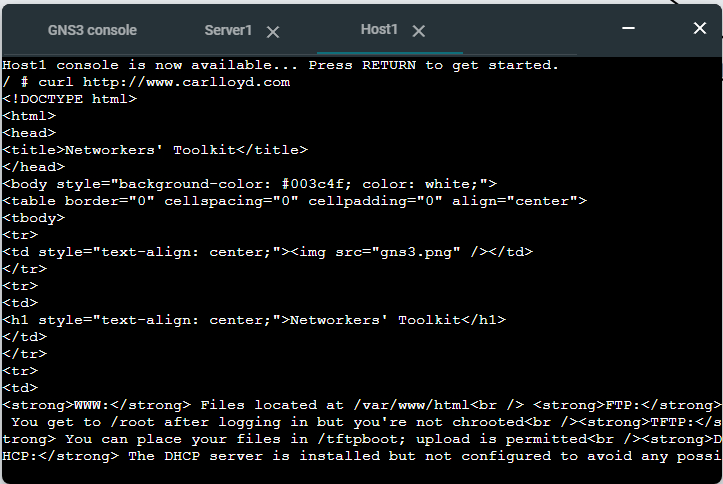
