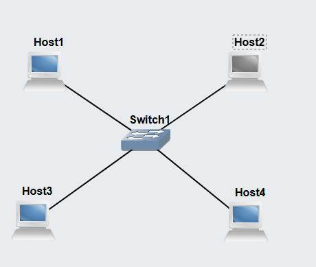
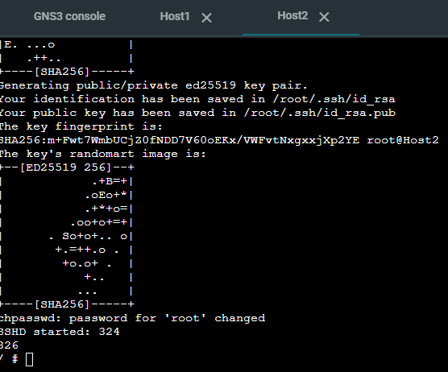
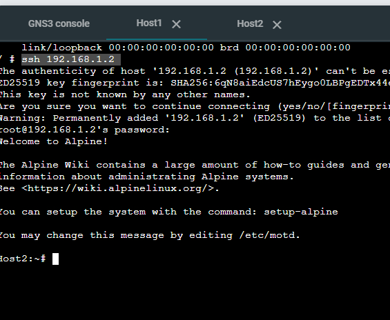
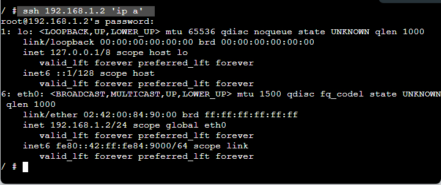

# Week 10 Secure Networking

## task 1.

1. Use the Setting-IP-<studentid> project which contains four Linux hosts and one Ethernet switch. Ensure all hosts have IP addresses. We will refer to the hosts as host A, host B, host C and host D.



2. Start the SSH server on host B using command start-ssh.sh

   

   ```bash
   start-ssh.sh
   ```

3. Use the SSH client on host A to login to host B.
   

   ```bash
   ssh <ip of host ssh server>
   ```

4. Run some commands on host B while logged in, e.g., view the IP address or create a file.
   
5. Exit the SSH connection.
6. Use the SSH client again on host A, but this time run a single command on host B and then exit. Do not use an interactive login.
   
